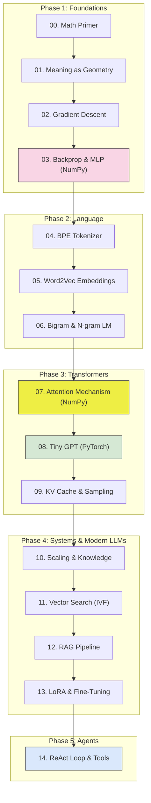

# LLMs From First Principles — A Hands-On Curriculum for Engineers

[](LICENSE)
[](https://www.python.org/downloads/)
[](tests/)
[](https://colab.research.google.com/github/fork-demon/llm-from-scratch)

**Build a working miniature GPT from scratch — in clean, self-contained Python without framework magic.**

You'll write a tokenizer, implement backward pass matrix calculus by hand, build multi-head attention with NumPy, train a toy transformer that generates text, and assemble a vector search + RAG pipeline.

---

## ⚡ Quick Start

```bash
# 1. Clone repo
git clone https://github.com/fork-demon/llm-from-scratch.git
cd llm-from-scratch

# 2. Install dependencies (NumPy, PyTorch, Matplotlib)
make install
# or: pip install -r requirements.txt

# 3. Verify setup by running unit tests & gradient checks
make test

# 4. Run Phase 1 Foundation scripts
make run-phase1
```

---

## 🗺️ Curriculum & Progress Tracker

Track your learning journey by checking off modules as you build and break the code:

### Phase 1: Foundations (The Mechanics of Learning)
- [ ] **[00 — The Math You Actually Need](phase1-foundations/00-math-primer.md)** | Code: `math_primer.py`
  - *Vectors, dot products as agreement meters, matrix shapes, nudges & chain rule.*
- [ ] **[01 — Meaning as Geometry](phase1-foundations/01-meaning-as-geometry.md)**
  - *Why IDs fail, high-dimensional spaces, words as coordinates.*
- [ ] **[02 — Gradient Descent](phase1-foundations/02-gradient-descent.md)** | Code: `gradient_descent.py`
  - *Loss landscapes, learning rate stability boundaries, watching a linear model fail.*
- [ ] **[03 — Neural Networks & Backpropagation](phase1-foundations/03-neural-net-backprop.md)** | Code: `mlp_numpy.py`
  - *The load-bearing module: non-linear hinges (ReLU), softmax + cross-entropy, exact backward pass in NumPy.*

### Phase 2: Language & Representations
- [ ] **[04 — Tokenization](phase2-language/04-tokenization.md)** | Code: `bpe_tokenizer.py`
  - *Byte-Pair Encoding (BPE) from scratch, merge tables, why chunking breaks letter counting.*
- [ ] **[05 — Embeddings](phase2-language/05-embeddings.md)** | Code: `tiny_word2vec.py`
  - *Skip-gram, moving vectors toward context neighbors, cosine similarity.*
- [ ] **[06 — Your First Language Model](phase2-language/06-first-language-model.md)** | Code: `bigram_lm.py`
  - *Autoregressive generation, bigram tables, n-gram state explosion wall.*

### Phase 3: Transformers (The Modern Engine)
- [ ] **[07 — Self-Attention](phase3-transformers/07-attention.md)** | Code: `attention_numpy.py`
  - *The soft key-value store: Queries, Keys, Values, causal masking, multi-head splits.*
- [ ] **[08 — Building Tiny GPT](phase3-transformers/08-tiny-gpt.md)** | Code: `tiny_gpt.py`
  - *Residual connections, LayerNorm, multi-head attention blocks, PyTorch transition.*
- [ ] **[09 — Training & Inference](phase3-transformers/09-training-and-inference.md)** | Code: `kv_cache_demo.py`
  - *Autoregressive sampling (temperature, top-k), KV-cache speedup.*

### Phase 4: Modern LLM Architecture & Systems
- [ ] **[10 — Knowledge, Scaling & Hallucination](phase4-modern-llms/10-knowledge-scaling-hallucination.md)**
  - *Where facts live (FFN weights vs embeddings), memorization vs generalization, superposition.*
- [ ] **[11 — Vector Search](phase4-modern-llms/11-vector-search.md)** | Code: `vector_db.py`
  - *Exact kNN vs Inverted File Index (IVF), clustering, semantic search.*
- [ ] **[12 — RAG: Retrieval-Augmented Generation](phase4-modern-llms/12-rag.md)** | Code: `mini_rag.py`
  - *Chunking, dense retrieval, prompt injection defense, grounding responses.*
- [ ] **[13 — Fine-Tuning & Adaptation](phase4-modern-llms/13-fine-tuning.md)** | Code: `finetune_tiny_gpt.py`
  - *Full SFT vs LoRA (low-rank adapters), catastrophic forgetting.*

### Phase 5: Agents & Tool Calling (Capstone)
- [ ] **[14 — Agents From First Principles](phase5-agents/14-agents.md)** | Code: `mini_agent.py`
  - *The ReAct loop, tool registries, parsing completions, offline mock LLM engine.*

---

## 🛠️ Repository Architecture



---

## 🎯 Ground Rules & Debugging Workflow

1. **Run every line of code.** Reading code produces passive familiarity; running and modifying it tests whether your mental model matches reality.
2. **NumPy until Module 08.** We use raw NumPy for matrix multiplications, activation gates, and backward gradient passes so you feel every dimension. We only switch to PyTorch once you could write what it automates.
3. **The 30-Minute Debugging Rule:**
   - Stuck on a bug? Check [`debugging-guide.md`](debugging-guide.md) — a symptom-to-fix lookup table.
   - Stuck on an exercise? Consult [`hints.md`](hints.md) — graduated hints revealing clues one level at a time.
   - Still confused? Re-read the module's mental model section; 95% of math confusion is an unstated engineering assumption.

---

## 📚 External Deep-Dives

See [`resources.md`](resources.md) for selected companion lectures, interactive tools, and foundational research papers (e.g. Karpathy's *Zero to Hero*, 3Blue1Brown, and Vaswani et al.).

## 📄 License
This project is open-source under the [MIT License](LICENSE).
