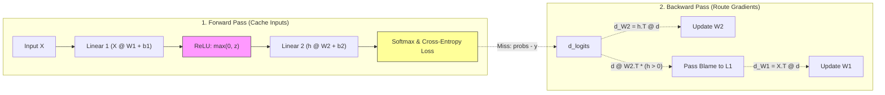

# Module 03 — Neural Networks & Backpropagation

> **⏱️ Time:** ~4 weeks. Code: [`mlp_numpy.py`](mlp_numpy.py).  
> **What you'll build:** A complete multi-layer perceptron (MLP) and manual backpropagation engine in raw NumPy.  
> **Key milestone:** Solve the non-linear spiral dataset (~98% accuracy) and verify your backward pass against a numerical gradient oracle to $10^{-12}$ precision.

---

## 🎯 TL;DR
1. **Depth alone does nothing:** Stacking linear layers collapses algebraically into a single linear layer: $(W_2 W_1)x = W_{combined}x$.
2. **The fix is a hinge (non-linearity):** Inserting `ReLU(x) = max(0, x)` breaks linearity, enabling deep networks to approximate any complex decision boundary.
3. **Backprop is localized message-passing:** By applying the chain rule in reverse, every layer computes its local parameter updates using only its cached activations and the blame signal (`d_out`) handed backward from downstream.



---

## 1. The Wall: Why Deep Linear Models Fail

In Module 02, you trained a single linear classifier. On clean linear separations, it worked. On curves or spirals, it hit an impenetrable performance ceiling.

The obvious developer instinct is: *add more layers*. If one transformation `W1 @ x` isn't enough, why not `W2 @ (W1 @ x)`?

The linear algebra reality:
$$W_2 (W_1 x) = (W_2 W_1) x = W_{combo} x$$

Stacking 100 linear layers produces an expensive way to compute a single straight line.

---

## 2. The Fix: Non-Linear Activation Hinges

To break the mathematical collapse, we pass every intermediate layer through an activation function. The simplest, battle-tested standard is **ReLU** (*Rectified Linear Unit*):

```python
def relu(x):
    return np.maximum(0, x)
```

- Negative inputs are squashed to zero.
- Positive inputs pass through unchanged.

That single bend allows stacks of linear pieces to approximate any continuous curve:

<svg xmlns="http://www.w3.org/2000/svg" viewBox="0 0 760 340" font-family="sans-serif">
  <rect width="760" height="340" fill="#ffffff"/>
  <text x="380" y="26" text-anchor="middle" font-size="17" font-weight="bold" fill="#333">Why activation functions: hinged pieces compose into any curve</text>
  <text x="150" y="60" text-anchor="middle" font-size="13" fill="#E8734A" font-weight="bold">linear layers only</text>
  <rect x="45" y="70" width="210" height="180" rx="8" fill="#fcfcfc" stroke="#ddd"/>
  <path d="M 60 220 Q 110 100 150 170 Q 190 235 240 110" fill="none" stroke="#bbb" stroke-width="2" stroke-dasharray="4,3"/>
  <line x1="60" y1="200" x2="240" y2="140" stroke="#E8734A" stroke-width="3"/>
  <text x="150" y="270" text-anchor="middle" font-size="11" fill="#666">stack 100 linear layers →</text>
  <text x="150" y="285" text-anchor="middle" font-size="11" fill="#666">still ONE straight line</text>
  <text x="150" y="300" text-anchor="middle" font-size="11" fill="#888" font-family="monospace">W2·(W1·x) = (W2·W1)·x</text>
  <text x="380" y="60" text-anchor="middle" font-size="13" fill="#4A90D9" font-weight="bold">ReLU: max(0, x) — a hinge</text>
  <rect x="285" y="70" width="190" height="180" rx="8" fill="#fcfcfc" stroke="#ddd"/>
  <line x1="300" y1="160" x2="460" y2="160" stroke="#eee" stroke-width="1"/>
  <line x1="380" y1="85" x2="380" y2="235" stroke="#eee" stroke-width="1"/>
  <path d="M 300 160 L 380 160 L 455 90" fill="none" stroke="#4A90D9" stroke-width="3"/>
  <text x="330" y="180" font-size="11" fill="#888">negative → 0</text>
  <text x="395" y="115" font-size="11" fill="#888">positive → passes</text>
  <text x="380" y="270" text-anchor="middle" font-size="11" fill="#666">one bend. Nearly nothing —</text>
  <text x="380" y="285" text-anchor="middle" font-size="11" fill="#666">but it breaks the collapse.</text>
  <text x="615" y="60" text-anchor="middle" font-size="13" fill="#55A868" font-weight="bold">thousands of hinges, stacked</text>
  <rect x="505" y="70" width="220" height="180" rx="8" fill="#fcfcfc" stroke="#ddd"/>
  <path d="M 520 220 Q 570 100 610 170 Q 650 235 710 110" fill="none" stroke="#bbb" stroke-width="2" stroke-dasharray="4,3"/>
  <path d="M 520 218 L 545 175 L 565 130 L 585 122 L 605 158 L 622 185 L 638 195 L 658 175 L 678 145 L 710 112" fill="none" stroke="#55A868" stroke-width="3"/>
  <text x="615" y="270" text-anchor="middle" font-size="11" fill="#666">short straight pieces approximate any curve;</text>
  <text x="615" y="285" text-anchor="middle" font-size="11" fill="#666">deeper layers bend already-bent space —</text>
  <text x="615" y="300" text-anchor="middle" font-size="11" fill="#666">complexity compounds multiplicatively</text>
  <text x="380" y="328" text-anchor="middle" font-size="12" fill="#888">This one-line function, max(0, x), is the entire difference between linear regression and deep learning.</text>
</svg>

---

## 3. Softmax & Cross-Entropy: Turning Scores into Probabilities

At the final layer, our network produces unnormalized raw scores (**logits**), such as `[2.0, 1.0, -1.0]`.

To convert logits into valid probabilities:
1. Exponentiate ($e^z$): forces all values positive and amplifies the margin between winners and losers.
2. Normalize: divide by row sum so all output probabilities sum to 1.0.

<details>
<summary><b>🔍 Code Walkthrough: The Numerical Stability Trick in Softmax</b></summary>

```python
def softmax(logits):
    # CRITICAL: exp(1000) overflows float64 to inf or NaN.
    # Subtracting the row maximum leaves the relative probabilities unchanged:
    z = logits - logits.max(axis=1, keepdims=True)
    e = np.exp(z)
    return e / e.sum(axis=1, keepdims=True)
```
</details>

### Cross-Entropy Loss: The Average Surprise
For target class index $y$, loss is the negative log-probability assigned to the correct class:
$$\mathcal{L} = -\frac{1}{N} \sum_{i=1}^N \log(P_{\text{correct}})$$

The derivative of Softmax combined with Cross-Entropy simplifies elegantly:
$$\frac{\partial \mathcal{L}}{\partial \text{logits}} = \frac{\text{probs} - \text{one\_hot}(y)}{N}$$

The gradient is simply the **miss**: predicted probability minus actual outcome.

---

## 4. Backpropagation: The Assembly Line in Reverse

<svg xmlns="http://www.w3.org/2000/svg" viewBox="0 0 760 410" font-family="sans-serif">
  <rect width="760" height="410" fill="#ffffff"/>
  <text x="380" y="26" text-anchor="middle" font-size="17" font-weight="bold" fill="#333">Backpropagation: forward builds activations, backward routes blame</text>
  <defs>
    <marker id="fwd" markerWidth="8" markerHeight="8" refX="7" refY="3" orient="auto"><path d="M0,0 L7,3 L0,6 z" fill="#4A90D9"/></marker>
    <marker id="bwd" markerWidth="8" markerHeight="8" refX="7" refY="3" orient="auto"><path d="M0,0 L7,3 L0,6 z" fill="#E8734A"/></marker>
  </defs>
  <rect x="40" y="100" width="100" height="40" rx="8" fill="#f6f8fa" stroke="#bbb"/><text x="90" y="125" text-anchor="middle" font-size="13" fill="#333">x (input)</text>
  <rect x="220" y="100" width="120" height="40" rx="8" fill="#eef4fb" stroke="#4A90D9"/><text x="280" y="125" text-anchor="middle" font-size="13" fill="#333">Layer 1: h</text>
  <rect x="420" y="100" width="120" height="40" rx="8" fill="#eef4fb" stroke="#4A90D9"/><text x="480" y="125" text-anchor="middle" font-size="13" fill="#333">Layer 2: out</text>
  <rect x="620" y="100" width="100" height="40" rx="8" fill="#fdf3ee" stroke="#E8734A"/><text x="670" y="125" text-anchor="middle" font-size="13" fill="#333">Loss L</text>
  <line x1="140" y1="120" x2="212" y2="120" stroke="#4A90D9" stroke-width="2.5" marker-end="url(#fwd)"/>
  <line x1="340" y1="120" x2="412" y2="120" stroke="#4A90D9" stroke-width="2.5" marker-end="url(#fwd)"/>
  <line x1="540" y1="120" x2="612" y2="120" stroke="#4A90D9" stroke-width="2.5" marker-end="url(#fwd)"/>
  <line x1="620" y1="240" x2="488" y2="240" stroke="#E8734A" stroke-width="2.5" marker-end="url(#bwd)"/>
  <line x1="360" y1="240" x2="308" y2="240" stroke="#E8734A" stroke-width="2.5" marker-end="url(#bwd)"/>
  <line x1="180" y1="240" x2="128" y2="240" stroke="#E8734A" stroke-width="2.5" marker-end="url(#bwd)"/>
  <rect x="360" y="214" width="120" height="52" rx="8" fill="#fdf3ee" stroke="#E8734A"/>
  <text x="420" y="236" text-anchor="middle" font-size="12" fill="#333">Layer 2's blame</text>
  <text x="420" y="254" text-anchor="middle" font-size="11" fill="#666" font-family="monospace">d = d @ W2.T</text>
  <rect x="180" y="214" width="120" height="52" rx="8" fill="#fdf3ee" stroke="#E8734A"/>
  <text x="240" y="236" text-anchor="middle" font-size="12" fill="#333">Layer 1's blame</text>
  <text x="240" y="254" text-anchor="middle" font-size="11" fill="#666" font-family="monospace">d = d * (x&gt;0)</text>
  <rect x="540" y="214" width="120" height="52" rx="8" fill="#fdf3ee" stroke="#E8734A"/>
  <text x="600" y="236" text-anchor="middle" font-size="12" fill="#333">start: the miss</text>
  <text x="600" y="254" text-anchor="middle" font-size="11" fill="#666" font-family="monospace">probs − one_hot</text>
  <line x1="240" y1="266" x2="240" y2="310" stroke="#55A868" stroke-width="2" marker-end="url(#fwd)" stroke-dasharray="4,3"/>
  <line x1="420" y1="266" x2="420" y2="310" stroke="#55A868" stroke-width="2" marker-end="url(#fwd)" stroke-dasharray="4,3"/>
  <rect x="165" y="312" width="150" height="40" rx="8" fill="#eefaf1" stroke="#55A868"/>
  <text x="240" y="337" text-anchor="middle" font-size="11" fill="#333" font-family="monospace">d_W1 = x.T @ d</text>
  <rect x="345" y="312" width="150" height="40" rx="8" fill="#eefaf1" stroke="#55A868"/>
  <text x="420" y="337" text-anchor="middle" font-size="11" fill="#333" font-family="monospace">d_W2 = h.T @ d</text>
  <text x="600" y="337" font-size="12" fill="#55A868">→ then: W -= lr * d_W</text>
  <text x="380" y="385" text-anchor="middle" font-size="12" fill="#888">Each station needs only LOCAL knowledge + the blame message handed back from downstream.</text>
</svg>

### The Three Backward Pass Rules

| Forward Operation | Backward Gradient Rule | Plain English Rationale |
|---|---|---|
| `out = X @ W + b` | `d_W = X.T @ d_out`<br>`d_X = d_out @ W.T`<br>`d_b = d_out.sum(axis=0)` | Blame routes back through the transposed network weights. |
| `out = relu(x)` | `d_x = d_out * (x > 0)` | Blame passes where the gate was open; zeroed out where closed. |
| `Softmax + CrossEntropy` | `d_logits = (probs - y_onehot) / N` | Initial error signal: prediction minus truth. |

---

## 5. Running the Code & Expected Output

Run the complete NumPy implementation:

```bash
python phase1-foundations/mlp_numpy.py
```

### Expected Output

```
============================================================
1) LINEAR model on the spiral (this should struggle)
============================================================
  final loss 0.7331, accuracy 0.540  <- the linear ceiling

============================================================
2) MLP (2 -> 64 -> 64 -> 3) on the same data
============================================================
  step    0  loss 1.1000  acc 0.470
  step  400  loss 0.0826  acc 0.970
  step  800  loss 0.0399  acc 0.987
  step 1200  loss 0.0321  acc 0.987
  step 1600  loss 0.0285  acc 0.987
  final accuracy 0.987  <- nonlinearity earns its keep

============================================================
3) Gradient check (backprop vs numerical oracle)
============================================================
  param        backprop      numerical     |diff|
  W1[52,54]     0.00023142    0.00023142  4.28e-13
  W0[ 1, 3]     0.00000000    0.00000000  0.00e+00
  W2[61, 2]     0.00176530    0.00176530  7.42e-13
  worst diff 1.22e-12 -> PASS
```

> **🛑 CHECKPOINT:** If your gradient check outputs `worst diff > 1e-5`, backprop is broken. Inspect the transposed dot product order.

---

## 6. Common Pitfalls & Debugging Lookup

| Symptom | Probable Cause | Fix |
|---|---|---|
| **`worst diff > 1e-1` in gradient check** | Transposed wrong array in backward pass. | Check `d_W = h_in.T @ d` and `d_in = d @ W.T`. Inner dimensions must match. |
| **Loss becomes `NaN` or `inf`** | Softmax overflow or `log(0)`. | Subtract row max before `exp()`: `z = x - x.max()`. Guard log with `1e-12`. |
| **Loss stuck at random chance (~33%)** | Zero-weight initialization. | Zero weights produce symmetric gradients. Initialize with small random values (`0.1 * randn()`). |

---

## 7. Hands-On Exercises

<details>
<summary><b>Exercise 1: Remove ReLU & Witness the Collapse</b></summary>

In `MLP.forward()`, replace `np.maximum(0, ...)` with identity passthrough.
Retrain. Does accuracy top out at ~54%?
*Hint: Module hints file, Module 03 Ex 1.*
</details>

<details>
<summary><b>Exercise 2: Width Sweep & Representational Capacity</b></summary>

Change `sizes=(2, 64, 64, 3)` to `sizes=(2, 4, 4, 3)`.
Notice where accuracy stalls. Why can't 4 neurons separate 3 spirals?
</details>

<details>
<summary><b>Exercise 3: Catch a Planted Transpose Bug</b></summary>

Swap `h_in.T @ d` to `h_in @ d.T` in `backward()`. Run the gradient check.
Observe the mismatch magnitude.
</details>

---

## 🔗 Next Step
Now that you have built a complete neural network and manual backpropagation engine, Phase 2 begins.  
Proceed to **[Module 04 — Tokenization](../phase2-language/04-tokenization.md)** to turn raw text into integers.
