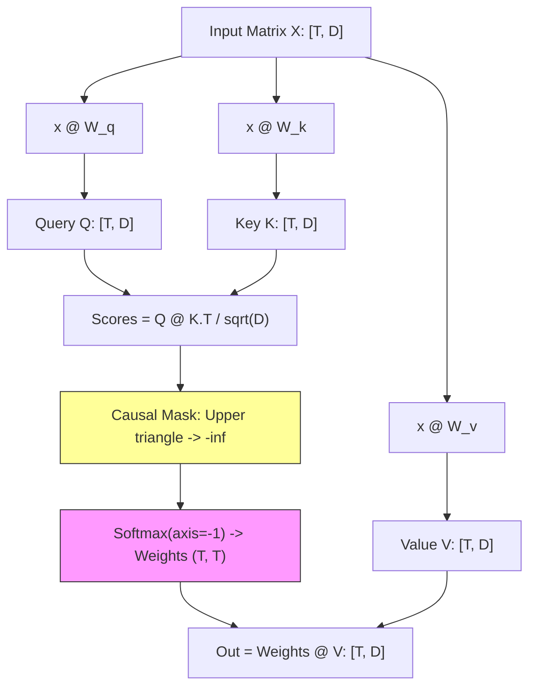

# Module 07 — Self-Attention: The Idea Worth the Whole Course

> **⏱️ Time:** ~4 weeks. Code: [`attention_numpy.py`](attention_numpy.py).  
> **What you'll build:** Single-head & Multi-head attention from scratch in NumPy with causal masking and gradient checks.  
> **Interactive companion:** [Transformer Explainer (live in browser)](https://poloclub.github.io/transformer-explainer/)

---

## 🎯 TL;DR
1. **The Core Bottleneck of RNNs:** Sequential dependencies prevent parallel training ($O(T)$ steps), and fixed-size hidden vectors form an informational bottleneck over long horizons.
2. **The Transformer Shift:** Replace recurrence with pairwise routing. Every token attends directly to all preceding tokens via matrix multiplication:
   $$\text{Attention}(Q, K, V) = \text{softmax}\left(\frac{Q K^T}{\sqrt{d_k}}\right) V$$
3. **Database Analogy:** Tokens broadcast **Queries** (what am I looking for?), match against **Keys** (what kind of info do I have?), and retrieve weighted sums of **Values** (payloads).



---
## Two Problems, Carried In From Earlier Modules

You arrive at this module holding two loose ends, both earned honestly:

From module 06: more context wins (your 3-character model crushed the bigram), but concatenating embeddings is a clumsy way to provide context — each position is rigidly separate, patterns don't transfer between positions, and it can't stretch to long text.

From module 05: a word gets ONE frozen vector. "Bank" has a single point in space, awkwardly averaged between riverbanks and finance, wrong for every actual sentence it appears in.

Before transformers (2017), the standard answer to the context problem was a family of models called **RNNs and LSTMs**: read the text one token at a time, left to right, maintaining a running summary vector — like taking notes with a fixed-size notepad while someone talks. Two engineering flaws eventually killed them, and both will feel familiar to you as a systems person:

**Flaw 1 — the bottleneck.** The entire past gets squeezed through one fixed-size summary. By the time an RNN reaches word 500, whatever word 3 contributed has been re-compressed 497 times. It's the telephone game: information about the beginning arrives at the end mangled or gone.

**Flaw 2 — no parallelism.** Step *t* cannot start until step *t−1* finishes — a strict sequential dependency down the whole text. GPUs, which are throughput machines that want ten thousand independent jobs at once, sat mostly idle. Training was slow not because of compute cost but because the algorithm *couldn't be parallelized* along the text.

The 2017 transformer paper's answer to both flaws is one radical move:

> **Stop summarizing. Let every token look directly at every other token, and decide for itself, pair by pair, what's relevant.**

No summary bottleneck — word 500 can inspect word 3 directly, first-hand. No sequential chain — all the pairwise looks happen simultaneously, as one giant matrix multiply, which is the exact shape of work GPUs devour. The paper's famous title, "Attention Is All You Need," is a literal engineering claim: delete the recurrence, keep only this looking mechanism, and things get both better *and* faster.

## The Mechanism: Every Token Runs a Little Search Query

So what is "looking at other tokens," concretely? Here's the intuition that maps cleanly onto the real math — and conveniently, it's an intuition from your day job. Attention works like a **soft key-value store lookup**:

- Every token publishes a **key** (K): a short advertisement — *"here's the kind of information I hold."*
- Every token issues a **query** (Q): a search request — *"here's the kind of information I'm looking for."*
- Every token also prepares a **value** (V): a payload — *"if someone finds me relevant, this is what I'll actually give them."*

Let's run the sentence "the river bank" through this, focusing on what "bank" does:

<svg xmlns="http://www.w3.org/2000/svg" viewBox="0 0 760 460" font-family="sans-serif">
  <rect width="760" height="460" fill="#ffffff"/>
  <text x="380" y="26" text-anchor="middle" font-size="17" font-weight="bold" fill="#333">Self-attention: "bank" queries its context and blends the relevant values</text>

  <defs>
    <marker id="qa" markerWidth="8" markerHeight="8" refX="7" refY="3" orient="auto">
      <path d="M0,0 L7,3 L0,6 z" fill="#4A90D9"/>
    </marker>
    <marker id="va" markerWidth="8" markerHeight="8" refX="7" refY="3" orient="auto">
      <path d="M0,0 L7,3 L0,6 z" fill="#55A868"/>
    </marker>
  </defs>

  <!-- tokens -->
  <g text-anchor="middle">
    <rect x="60" y="60" width="120" height="44" rx="8" fill="#f6f8fa" stroke="#bbb"/>
    <text x="120" y="88" font-size="15" fill="#333">the</text>
    <rect x="320" y="60" width="120" height="44" rx="8" fill="#f6f8fa" stroke="#bbb"/>
    <text x="380" y="88" font-size="15" fill="#333">river</text>
    <rect x="580" y="60" width="120" height="44" rx="8" fill="#fdf3ee" stroke="#E8734A" stroke-width="2"/>
    <text x="640" y="88" font-size="15" fill="#333">bank ?</text>
  </g>

  <!-- keys row -->
  <g text-anchor="middle">
    <rect x="75" y="150" width="90" height="34" rx="6" fill="#eef4fb" stroke="#4A90D9"/>
    <text x="120" y="172" font-size="12" fill="#333">K: "article"</text>
    <rect x="335" y="150" width="90" height="34" rx="6" fill="#eef4fb" stroke="#4A90D9"/>
    <text x="380" y="172" font-size="12" fill="#333">K: "watery"</text>
    <rect x="595" y="150" width="90" height="34" rx="6" fill="#eef4fb" stroke="#4A90D9"/>
    <text x="640" y="172" font-size="12" fill="#333">K: "noun"</text>
    <line x1="120" y1="104" x2="120" y2="146" stroke="#bbb" stroke-width="1.5"/>
    <line x1="380" y1="104" x2="380" y2="146" stroke="#bbb" stroke-width="1.5"/>
    <line x1="640" y1="104" x2="640" y2="146" stroke="#bbb" stroke-width="1.5"/>
  </g>

  <!-- bank's query probing each key -->
  <rect x="530" y="215" width="220" height="36" rx="6" fill="#fdf3ee" stroke="#E8734A"/>
  <text x="640" y="238" text-anchor="middle" font-size="12" fill="#333">Q of "bank": seeking disambiguation</text>
  <line x1="545" y1="215" x2="145" y2="190" stroke="#4A90D9" stroke-width="2" marker-end="url(#qa)"/>
  <line x1="560" y1="215" x2="400" y2="190" stroke="#4A90D9" stroke-width="2.5" marker-end="url(#qa)"/>
  <line x1="640" y1="215" x2="640" y2="190" stroke="#4A90D9" stroke-width="2" marker-end="url(#qa)"/>
  <text x="330" y="215" font-size="11" fill="#4A90D9">dot products = relevance scores</text>

  <!-- softmax weights -->
  <rect x="130" y="285" width="500" height="36" rx="8" fill="#f6f8fa" stroke="#ddd"/>
  <text x="380" y="308" text-anchor="middle" font-size="13" fill="#333" font-family="monospace">softmax → weights:  the 0.06   river 0.47   bank 0.47   (sum = 1)</text>

  <!-- values blending -->
  <g text-anchor="middle">
    <rect x="75" y="345" width="90" height="34" rx="6" fill="#eefaf1" stroke="#55A868"/>
    <text x="120" y="367" font-size="12" fill="#333">V of "the"</text>
    <rect x="335" y="345" width="90" height="34" rx="6" fill="#eefaf1" stroke="#55A868"/>
    <text x="380" y="367" font-size="12" fill="#333">V of "river"</text>
    <rect x="595" y="345" width="90" height="34" rx="6" fill="#eefaf1" stroke="#55A868"/>
    <text x="640" y="367" font-size="12" fill="#333">V of "bank"</text>
  </g>
  <line x1="140" y1="379" x2="350" y2="412" stroke="#55A868" stroke-width="1.5" marker-end="url(#va)" opacity="0.5"/>
  <line x1="390" y1="379" x2="400" y2="408" stroke="#55A868" stroke-width="3" marker-end="url(#va)"/>
  <line x1="620" y1="379" x2="450" y2="412" stroke="#55A868" stroke-width="3" marker-end="url(#va)"/>
  <text x="120" y="400" font-size="11" fill="#888">× 0.06</text>
  <text x="410" y="398" font-size="11" fill="#55A868" font-weight="bold">× 0.47</text>
  <text x="545" y="400" font-size="11" fill="#55A868" font-weight="bold">× 0.47</text>

  <rect x="290" y="412" width="220" height="38" rx="8" fill="#fdf3ee" stroke="#E8734A" stroke-width="2"/>
  <text x="400" y="436" text-anchor="middle" font-size="13" fill="#333">new "bank" vector: river-flavored</text>
</svg>

*"Bank" broadcasts a query, matches it against every key, and rebuilds itself as a weighted blend of the values*

Step by step, in words:

1. "Bank" issues its query — something that effectively says *"I'm an ambiguous noun; I need disambiguating context."*
2. That query is compared against every token's key. Compared how? **The dot product** — module 00's agreement meter, doing the most important job of its career. "River"'s key ("I'm about water and nature") agrees strongly with bank's query → big score. "The"'s key barely matches → small score.
3. The scores go through **softmax** (module 03 — scores into probabilities), producing mixing weights that sum to 1: `the: 0.06, river: 0.47, bank: 0.47`.
4. "Bank"'s *new* vector is built as the weighted average of everyone's **values**: 6% of the's payload + 47% of river's + 47% of its own.

And look at what came out: a bank-vector *pulled toward the watery meaning* — because "river" was in the room. Run the same machine on "the money bank" and it drifts toward finance instead. **This is the fix for module 05's frozen-vector flaw.** The word's stored embedding is just a starting point; attention rewrites it, live, based on the company it's currently keeping. The rewritten result is called a *contextual embedding*, and it's the fundamental upgrade transformers brought.

One design detail explains why this is trainable at all: notice attention didn't *pick* the best match, like a hash lookup would. It took a *weighted blend of everything*. Blends are smooth — nudge the scores a little, the output changes a little — which means gradients flow through the whole thing, which means module 03's machinery can train it. (A hard "pick the winner" has no useful gradient; this "soft" version does. That's the "soft" in softmax, earning its keep.)

## Where Do Q, K, and V Come From?

Not from thin air — from three learned weight matrices. Each token's embedding `x` gets multiplied three ways:

```
q = x @ Wq        k = x @ Wk        v = x @ Wv
```

Same input, three different learned *projections* — three views of one token: *how I search* (q), *how I'm found* (k), *what I hand over* (v). The matrices Wq, Wk, Wv are ordinary parameters, sculpted by gradient descent like everything else.

Now the question every good tutorial should answer and most don't: **why three separate matrices? Why not just compare raw embeddings against each other?**

Because relevance is not the same thing as similarity — and relevance is *asymmetric*. Think about "the river bank": "river" is enormously useful *to* "bank" (it resolves the ambiguity), but "bank" isn't especially useful to "river" — river isn't confused about anything. Raw-embedding comparison can only measure *similarity*, which is symmetric: whatever river is to bank, bank is to river. Separate Q and K matrices let the model learn *directional* lookup — who needs whom. And the separate V matrix lets *what a token contributes* differ from *how it's indexed*, exactly like a search engine where the terms you index a document under aren't the document itself. Three matrices, three genuinely different jobs.

## The Formula, Which You Can Now Just Read

Here is the most famous equation in modern AI, from the 2017 paper:

```
Attention(Q, K, V) = softmax(Q @ K.T / √d) @ V
```

A year ago this might have made your eyes slide off. Read it now, piece by piece — you have every tool:

- **`Q @ K.T`** — module 00, section 6, verbatim: stack all queries as rows of Q, all keys as rows of K, and `Q @ K.T` dots *every query against every key* in one multiply. Out comes a T×T grid (T = number of tokens) where cell (i, j) = how much token i cares about token j. The whole "who should look at whom" question, answered in one matrix multiply.
- **`/ √d`** — a purely practical fix, no deep meaning. Dot products of long vectors (d = 64, 512...) produce big numbers just because there are many terms in the sum. Big scores shoved into softmax saturate it — one weight becomes ~1.0, the rest ~0.0, and gradients through a saturated softmax die (nothing left to nudge). Dividing by √d re-scales the scores into softmax's healthy range. This is the kind of fix you'd add on a Tuesday after watching your training loss flatline, and that's roughly its actual history.
- **`softmax`** — each row of scores becomes a row of mixing weights summing to 1.
- **`@ V`** — every token's output = its weights blended over everyone's values. The averaging step from the diagram, done for all tokens at once.

Three matrix multiplies and a softmax. You have known every ingredient since module 03. *That is self-attention, complete.*

## Three Add-Ons That Complete the Picture

**1. The causal mask — no reading ahead.** We're training on next-token prediction: token i's job is to help predict token i+1. If token i were allowed to attend to token i+1, it could just *look at the answer* — training would be a farce, and the model would be useless at inference time, when the future genuinely doesn't exist yet. The fix is blunt: in the T×T score grid, overwrite every cell where a token looks at its own future with −∞. Softmax turns −∞ into exactly 0 weight. One line of code.

<svg xmlns="http://www.w3.org/2000/svg" viewBox="0 0 760 360" font-family="sans-serif">
  <rect width="760" height="360" fill="#ffffff"/>
  <text x="380" y="26" text-anchor="middle" font-size="17" font-weight="bold" fill="#333">Causal mask: no token may look at its future</text>

  <!-- matrix grid: 5x5 -->
  <text x="215" y="65" text-anchor="middle" font-size="12" fill="#666">attention scores (T×T), sentence: "the cat sat on mats"</text>
  <!-- col labels -->
  <g font-size="11" fill="#888" text-anchor="middle">
    <text x="140" y="95">the</text><text x="185" y="95">cat</text><text x="230" y="95">sat</text><text x="275" y="95">on</text><text x="320" y="95">mats</text>
  </g>
  <!-- row labels -->
  <g font-size="11" fill="#888" text-anchor="end">
    <text x="112" y="128">the</text><text x="112" y="173">cat</text><text x="112" y="218">sat</text><text x="112" y="263">on</text><text x="112" y="308">mats</text>
  </g>
  <!-- cells: allowed lower triangle, blocked upper -->
  <g>
    <!-- row 0 -->
    <rect x="118" y="105" width="44" height="44" fill="#eef4fb" stroke="#fff"/>
    <rect x="163" y="105" width="44" height="44" fill="#f3d1c8" stroke="#fff"/>
    <rect x="208" y="105" width="44" height="44" fill="#f3d1c8" stroke="#fff"/>
    <rect x="253" y="105" width="44" height="44" fill="#f3d1c8" stroke="#fff"/>
    <rect x="298" y="105" width="44" height="44" fill="#f3d1c8" stroke="#fff"/>
    <!-- row 1 -->
    <rect x="118" y="150" width="44" height="44" fill="#eef4fb" stroke="#fff"/>
    <rect x="163" y="150" width="44" height="44" fill="#eef4fb" stroke="#fff"/>
    <rect x="208" y="150" width="44" height="44" fill="#f3d1c8" stroke="#fff"/>
    <rect x="253" y="150" width="44" height="44" fill="#f3d1c8" stroke="#fff"/>
    <rect x="298" y="150" width="44" height="44" fill="#f3d1c8" stroke="#fff"/>
    <!-- row 2 -->
    <rect x="118" y="195" width="44" height="44" fill="#eef4fb" stroke="#fff"/>
    <rect x="163" y="195" width="44" height="44" fill="#eef4fb" stroke="#fff"/>
    <rect x="208" y="195" width="44" height="44" fill="#eef4fb" stroke="#fff"/>
    <rect x="253" y="195" width="44" height="44" fill="#f3d1c8" stroke="#fff"/>
    <rect x="298" y="195" width="44" height="44" fill="#f3d1c8" stroke="#fff"/>
    <!-- row 3 -->
    <rect x="118" y="240" width="44" height="44" fill="#eef4fb" stroke="#fff"/>
    <rect x="163" y="240" width="44" height="44" fill="#eef4fb" stroke="#fff"/>
    <rect x="208" y="240" width="44" height="44" fill="#eef4fb" stroke="#fff"/>
    <rect x="253" y="240" width="44" height="44" fill="#eef4fb" stroke="#fff"/>
    <rect x="298" y="240" width="44" height="44" fill="#f3d1c8" stroke="#fff"/>
    <!-- row 4 -->
    <rect x="118" y="285" width="44" height="44" fill="#eef4fb" stroke="#fff"/>
    <rect x="163" y="285" width="44" height="44" fill="#eef4fb" stroke="#fff"/>
    <rect x="208" y="285" width="44" height="44" fill="#eef4fb" stroke="#fff"/>
    <rect x="253" y="285" width="44" height="44" fill="#eef4fb" stroke="#fff"/>
    <rect x="298" y="285" width="44" height="44" fill="#eef4fb" stroke="#fff"/>
  </g>
  <!-- -inf labels on a few blocked cells -->
  <g font-size="11" fill="#c0563a" text-anchor="middle" font-family="monospace">
    <text x="230" y="132">-∞</text><text x="275" y="132">-∞</text><text x="320" y="132">-∞</text>
    <text x="275" y="177">-∞</text><text x="320" y="177">-∞</text><text x="320" y="222">-∞</text>
  </g>
  <text x="185" y="132" font-size="11" fill="#4A90D9" text-anchor="middle" font-family="monospace">-∞</text>

  <!-- legend / explanation -->
  <rect x="420" y="105" width="16" height="16" fill="#eef4fb" stroke="#bbb"/>
  <text x="444" y="118" font-size="12" fill="#333">allowed: the past (and self)</text>
  <rect x="420" y="132" width="16" height="16" fill="#f3d1c8" stroke="#bbb"/>
  <text x="444" y="145" font-size="12" fill="#333">blocked: the future → set to −∞</text>

  <text x="420" y="185" font-size="12" fill="#666">−∞ before softmax → weight exactly 0.</text>
  <text x="420" y="205" font-size="12" fill="#666">Row i = what token i may attend to:</text>
  <text x="420" y="225" font-size="12" fill="#666">"sat" sees the, cat, sat — never on, mats.</text>

  <text x="420" y="265" font-size="12" fill="#333" font-weight="bold">Why: training predicts the next token.</text>
  <text x="420" y="285" font-size="12" fill="#666">Seeing the future = reading the answer key.</text>
  <text x="420" y="305" font-size="12" fill="#666">At inference the future genuinely doesn't</text>
  <text x="420" y="322" font-size="12" fill="#666">exist yet — the mask keeps training honest.</text>

  <text x="380" y="352" text-anchor="middle" font-size="11" fill="#888" font-family="monospace">code: scores[i, j&gt;i] = -inf   (one line — the entire "decoder-only" in decoder-only GPT)</text>
</svg>

*The staircase of the allowed past. This one masked triangle is what "decoder-only" means in "decoder-only GPT."*

**2. Positional encoding — because attention is order-blind.** Here's a subtle flaw you can verify in exercise 3: nothing in the attention formula knows *where* a token sits. Scramble the input tokens and the outputs scramble identically — attention treats the sentence as a *bag* of tokens. But "dog bites man" and "man bites dog" had better not mean the same thing! The classic fix is almost embarrassingly direct: learn a separate embedding *for each position* (position 0 has a vector, position 1 has a vector...), and simply **add** the position's vector to the token's vector before anything else happens. Now "dog at position 0" and "dog at position 2" enter the network as different points, and attention can learn order-dependent behavior. (Modern models use a fancier variant called RoPE — noted in module 10 — same purpose, better on long text.)

**3. Multi-head attention — several searches at once.** One attention pass computes one T×T relevance pattern — one *notion* of "what matters to me." But a token often needs several notions simultaneously: *where's my verb?* (grammar), *who does "it" refer to?* (reference), *what's the topic?* (theme). The solution: split the vector into, say, 4 slimmer slices and run 4 *independent* attention operations in parallel — each with its own Wq, Wk, Wv, each free to learn a different notion of relevance — then concatenate the results. Each parallel unit is called a **head**. The lovely accounting fact: 4 heads of dimension 16 cost the same as 1 head of dimension 64, so the extra flexibility is essentially free. And in trained models, researchers really do find individual heads with recognizable jobs — one tracking verb-subject pairs, another following pronouns.

## The Code

`attention_numpy.py` — pure NumPy, heavily commented — walks five demonstrations:

1. **Single-head attention** on a tiny sequence, with the full T×T weight grid printed so you can see, in actual numbers, who attends to whom.
2. **The causal mask**, printed before and after — watch the upper triangle turn to zeros.
3. **Multi-head split and concat**, with the shape of every array annotated on every line. (Shape confusion is 90% of why transformer code looks hard; this file is designed to vaccinate you.)
4. **The "river bank" demo** — hand-crafted vectors where you watch the ambiguous token's output get pulled toward its disambiguator, with the exact numbers from this module's diagram.
5. **A gradient check through the whole attention layer** — module 03's ritual: backprop through attention (it's just the three table rules plus softmax's rule), verified against the slow honest nudge method to twelve decimal places. Attention is not exempt from the rules you already know; this proves it.

## Modify-It Exercises

1. Delete the `/ √d` scaling, crank d up to 256, and print the softmax outputs. Watch the weights collapse to all-or-nothing (1.0 here, 0.0 everywhere else). You've reproduced the exact disease the scaling cures — now you'll never wonder what that √d is for.
2. Turn off the causal mask in the demo and articulate, in one written sentence, why a model trained with future-peeking is worthless at generation time. (Hint: at generation time, where would it peek?)
3. Prove the order-blindness claim: with positional encodings off, shuffle the input tokens and verify the outputs shuffle identically (same values, new positions). Turn positional encodings on and verify the outputs now genuinely change. Ten lines, and you've demonstrated *why* positional encoding must exist rather than trusting me.
4. Work out how the computation grows with sequence length T: the score grid is T×T, so...? Write the answer as O(...), then use it to explain — in one sentence each — why context windows are expensive to lengthen, and why the industry keeps announcing bigger ones like trophies. (You'll meet the memory half of this story in module 09.)

## Best External Resources

- Jay Alammar, *"The Illustrated Transformer"* — the canonical visual walkthrough. Read it *after* your code runs; his diagrams and your printed matrices are the same objects.
- 3Blue1Brown, *"Attention in transformers, visually explained"* (Deep Learning chapter 6) — the best animation of Q/K/V ever made. Same rule as always: build first, then watch.

Next: **08 — Assemble the Tiny GPT.** Truly no new ideas remain — the leftover parts (residual connections, layer norm) are plumbing whose necessity you *already felt* in module 03, exercise 4. Time to build the whole machine.
